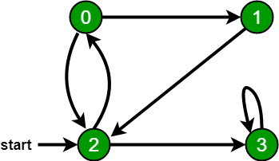

# Graph Search
This project demonstrates 
- Depth First Search (DFS)
- Breadth First Search (BFS)

on a graph created in the `App.class`. The graph can be visualized as follows:



<sub><sup>[Source](https://www.geeksforgeeks.org/breadth-first-search-or-bfs-for-a-graph/)

## Depth First Search (DFS)
In DFS, the algorithm first searches one branch, or one leg, 
or one edge of the node before looking at any of the node's neighbours. This will
go as deep as the graph vertically before going horizontally.

For the sample graph we're using, the DFS output should be:
```
2 0 1 3
```

## Breadth First Search (BFS)
In BFS, the algorithm first searches all the neighbours or adjacent nodes 
of a node before going to the next level. So this will cover one level of the graph
before going to the next level.

For the sample graph we're using, the BFS output should be:
```
2 0 3 1
``` 